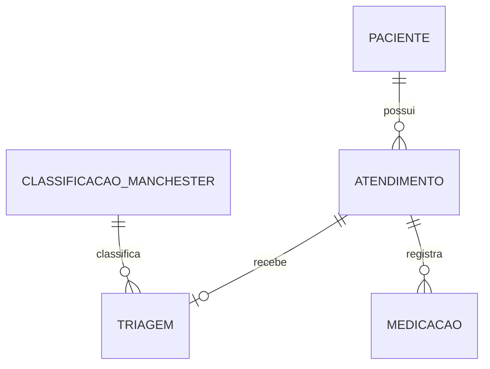

# PONTIFÍCIA UNIVERSIDADE CATÓLICA DE CAMPINAS

**Lucas Nascimento, Miguel Trentini, Miguel Souza, Pablo André Valentim, William Rocha**

## RELATÓRIO DE PROJETO

### Sistema de Atendimento de Pronto Socorro (SAPS)

**Campinas — 2026**

---

**Centro de Ciências Exatas, Ambientais e de Tecnologia**
**Sistemas de Informação**

Relatório de projeto de sistema, apresentado no componente curricular Projeto Integrador II, do curso de Sistemas de Informação, da Escola Politécnica da Pontifícia Universidade Católica de Campinas.

**Orientador:** Fernando Henrique Carvalho Silva

**Campinas — 2026**

---

## SUMÁRIO

1. Introdução
2. Justificativa
3. Objetivos
4. Escopo
5. Requisitos Funcionais
6. Requisitos Não Funcionais
7. Metodologia Aplicada ao Projeto
8. Cronograma Executado
9. Modelagem do Banco de Dados
10. Protótipos
11. Conclusão
    11.1 Resultados obtidos
    11.2 Sugestões de melhorias
12. Referências

---

## 1. INTRODUÇÃO

A superlotação de prontos-socorros é um problema recorrente na saúde pública brasileira, e não se restringe a hospitais de pequeno porte ou regiões específicas do país. Um levantamento do Tribunal de Contas da União (TCU) apontou que, entre 116 hospitais visitados, 64% enfrentavam superlotação frequente, e outros 36% operavam acima da capacidade em determinados períodos (TELEMEDICINA MORSCH, 2024). Esse cenário costuma se traduzir em filas de espera longas, ocupação de corredores por pacientes e sobrecarga das equipes assistenciais (PORTAL AFYA, [s.d.]).

Uma das ferramentas mais utilizadas mundialmente para organizar esse fluxo é o Protocolo de Manchester, sistema de triagem que classifica os pacientes por gravidade clínica — e não por ordem de chegada — usando cinco cores que indicam a urgência do atendimento (GESTÃO DS, 2025). Criado no Reino Unido na década de 1990, o protocolo chegou ao Brasil em 2007 e se popularizou como o método de classificação de risco mais usado nos serviços de saúde do país (TELEMEDICINA MORSCH, 2024).

Um estudo publicado na Revista Remecs (2019), que revisou artigos científicos sobre o tema, concluiu que a aplicação correta do Protocolo de Manchester reduz o tempo de espera e aumenta a segurança dos pacientes, além de contribuir para a organização do fluxo de atendimento e a eliminação da superlotação. Mais recentemente, ganha força a digitalização desse processo: sistemas eletrônicos substituem formulários manuais, reduzindo erros de registro e permitindo o acompanhamento em tempo real dos tempos de espera (TOLIFE, 2025).

O projeto **SAPS — Sistema de Atendimento de Pronto Socorro** parte justamente dessa premissa: informatizar as três etapas do atendimento de emergência (Recepção, Triagem e Atendimento Médico), aplicando o Protocolo de Manchester de forma digital, íntegra e rastreável.

---

## 2. JUSTIFICATIVA

A gestão manual (em papel) do fluxo de um pronto-socorro apresenta limitações conhecidas: dificuldade de localizar rapidamente informações de um paciente, risco de perda de registros, ausência de visão consolidada da fila de espera e dificuldade de aplicar de forma consistente os critérios do Protocolo de Manchester.

Dados do próprio setor reforçam a urgência de soluções desse tipo: um projeto de melhoria de processos ("Lean nas Emergências") aplicado em vinte hospitais públicos brasileiros reduziu a superlotação em 43% em seis meses, com uma queda média de 39% no tempo entre a chegada do paciente e a alta, e cerca de 12 horas a menos de permanência no pronto-socorro (HOSPITAIS BRASIL, 2020). Isso demonstra que ganhos expressivos são possíveis quando o fluxo de atendimento é organizado e monitorado de forma sistemática — exatamente o papel que um sistema informatizado de apoio à triagem pode cumprir.

Do ponto de vista acadêmico, o desenvolvimento do SAPS também se justifica por unir, num único projeto prático, conhecimentos de banco de dados relacional, desenvolvimento web (front-end e back-end) e gestão de projetos em equipe — atendendo aos objetivos do componente curricular Projeto Integrador II.

---

## 3. OBJETIVOS

### Objetivo geral

Desenvolver um sistema web para controlar o atendimento de pacientes em um Pronto Socorro, desde a chegada na recepção até a alta médica, aplicando o Protocolo de Manchester para priorização do atendimento.

### Objetivos específicos

- Cadastrar os dados pessoais dos pacientes e gerar um número de atendimento único para cada visita;
- Registrar os dados de triagem coletados pela enfermagem (sinais vitais e queixas);
- Classificar cada atendimento segundo o Protocolo de Manchester;
- Disponibilizar ao médico um painel de atendimentos ordenado pela prioridade de Manchester;
- Registrar as medicações prescritas e a confirmação de cada atendimento;
- Permitir que a Recepção consulte, altere e cancele atendimentos enquanto não confirmados pelo médico.

---

## 4. ESCOPO

O SAPS abrange o atendimento interno de um Pronto Socorro, contemplando três frentes de usuário-chave: a equipe de **Recepção**, a equipe de **Enfermagem** (Triagem) e o **corpo médico**.

**Benefícios ao usuário-chave:** redução do tempo gasto na localização de informações do paciente, padronização da classificação de risco, e visão organizada da fila de espera para o médico, priorizando os casos mais graves.

**Dados relevantes que o sistema usa e produz:** dados pessoais do paciente, número do atendimento, sinais vitais, classificação de Manchester, medicações prescritas e status do atendimento ao longo do processo.

**Origem e destino das informações:** os dados são inseridos pela Recepção (cadastro), pela Enfermagem (triagem) e pelo Médico (medicação e confirmação), ficando armazenados em um banco de dados relacional único, acessível pelas três interfaces do sistema.

**Principais eventos automatizados:** geração automática do número de atendimento; atualização do status do atendimento a cada etapa concluída; ordenação automática do painel médico pela classificação de Manchester; bloqueio de alteração/cancelamento de atendimentos já confirmados.

---

## 5. REQUISITOS FUNCIONAIS

Os requisitos funcionais estão organizados por ator do sistema — Recepção, Enfermagem e Médico — refletindo as três etapas do processo de atendimento.

### 5.1 Recepção

| **Identificador** | **RF0001** |
|---|---|
| **Nome** | Cadastro de atendimento na Recepção |
| **Descrição / Regras** | A Recepção deverá cadastrar os dados pessoais do paciente (nome completo, endereço, RG, CPF, nome do pai, nome da mãe, data de nascimento) e o sistema deverá gerar automaticamente um número de atendimento sequencial (ex.: AT0001). |
| **Informações/dados** | Nome completo, CPF, RG, endereço, nome do pai, nome da mãe, data de nascimento |

| **Identificador** | **RF0002** |
|---|---|
| **Nome** | Consulta, alteração e cancelamento de atendimento |
| **Descrição / Regras** | A Recepção poderá consultar, alterar ou cancelar um atendimento, desde que este ainda não tenha sido confirmado pelo médico. Após a confirmação, nenhuma alteração é permitida. |
| **Informações/dados** | Número do atendimento, status do atendimento |

### 5.2 Enfermagem (Triagem)

| **Identificador** | **RF0003** |
|---|---|
| **Nome** | Registro de triagem e classificação de risco |
| **Descrição / Regras** | A Enfermagem deverá registrar, para o atendimento em curso, a pressão arterial, temperatura corporal, batimentos cardíacos e as principais queixas do paciente. Como parte da mesma triagem, a Enfermagem deverá classificar o atendimento em uma das cinco cores do Protocolo de Manchester (Vermelho, Laranja, Amarelo, Verde, Azul), cada uma associada a um tempo máximo de espera — a classificação é resultado direto da avaliação feita nesta etapa, não uma ação separada. |
| **Informações/dados** | Pressão arterial, temperatura, batimentos cardíacos, queixas, cor da classificação de Manchester, tempo máximo de espera |

### 5.3 Médico

| **Identificador** | **RF0004** |
|---|---|
| **Nome** | Painel de Atendimento do Médico |
| **Descrição / Regras** | O sistema deverá exibir ao médico a fila de atendimentos aguardando, ordenada pela classificação de Manchester definida na Triagem, mostrando número do atendimento, nome do paciente e data de nascimento. |
| **Informações/dados** | Número do atendimento, nome do paciente, data de nascimento, classificação |

| **Identificador** | **RF0005** |
|---|---|
| **Nome** | Registro de medicação e confirmação do atendimento |
| **Descrição / Regras** | O médico deverá poder registrar as medicações prescritas durante o atendimento e confirmar a conclusão do atendimento, encerrando o fluxo. |
| **Informações/dados** | Nome da medicação, dosagem, data/hora, confirmação |

---

## 6. REQUISITOS NÃO FUNCIONAIS

- **Disponibilidade:** o sistema deverá ficar disponível durante o horário de funcionamento do Pronto Socorro, sem interrupções que impeçam o registro de atendimentos.
- **Segurança:** o acesso aos dados dos pacientes deverá ser restrito às interfaces de Recepção, Triagem e Médico, evitando alteração indevida de atendimentos já confirmados.
- **Desempenho:** as operações de cadastro, consulta e atualização de atendimento deverão ser processadas em poucos segundos, garantindo agilidade no fluxo de urgência.
- **Usabilidade:** as interfaces deverão ser simples e diretas, considerando que serão operadas sob pressão de tempo por profissionais de saúde.
- **Integridade dos dados:** o banco de dados deverá impedir o cadastro de CPFs duplicados e de números de atendimento repetidos, através de restrições (UNIQUE) e chaves estrangeiras.
- **Portabilidade:** por ser um sistema web, deverá funcionar em diferentes navegadores sem necessidade de instalação local.

---

## 7. METODOLOGIA APLICADA AO PROJETO

O desenvolvimento do SAPS seguiu a Metodologia de Aprendizagem Baseada em Projetos (PBL, do inglês *Project-Based Learning*), estruturada nas etapas propostas pelo componente curricular Projeto Integrador II:

- **Introdução e Planejamento:** formação da equipe (Lucas Nascimento, Miguel Trentini, Miguel Souza, Pablo André Valentim e William Rocha), apresentação do tema pelo professor orientador (Sistema de Atendimento de Pronto Socorro) e levantamento inicial dos requisitos básicos do sistema.

- **Coleta:** a equipe definiu as ferramentas de apoio ao desenvolvimento — GitHub para versionamento de código e Trello para gestão das tarefas (organizado nas colunas Backlog, Em andamento, Em teste e Concluído) — e estabeleceu a stack do projeto: HTML, CSS e JavaScript no front-end, JavaScript no back-end e MySQL no banco de dados.

- **Desenvolvimento:** execução gradativa das etapas do projeto, com modelagem e implementação do banco de dados, seguida da construção das interfaces de Recepção, Triagem e Médico, documentando o progresso no README do repositório.

- **Revisão:** reuniões da equipe para realinhar decisões técnicas — como a mudança da tecnologia de back-end e a consolidação em um único repositório oficial — e discussão de pontos de modelagem com o professor orientador (como a decisão de representar a Classificação de Manchester como uma tabela própria, e não apenas um campo).

- **Finalização:** etapa planejada para o refinamento do sistema, os testes do fluxo completo, a consolidação da documentação e a preparação da apresentação ao professor orientador.

---

## 8. CRONOGRAMA EXECUTADO

O quadro a seguir consolida o andamento registrado no README, no repositório GitHub e no Trello em 17 de setembro de 2026. Datas e horas individuais não foram incluídas porque ainda não há um registro único e validado dessas informações.

| Frente de trabalho | Situação atual | Evidência do projeto |
|---|---|---|
| Levantamento inicial de requisitos | Concluído | Requisitos e fluxo documentados no README |
| Definição da tecnologia do back-end | Concluído | Cartão concluído no Trello; JavaScript definido no README |
| Modelagem do banco de dados | Concluído | Cartão concluído no Trello e estrutura relacional definida |
| Script SQL | Em andamento | Arquivo `database/script.sql` presente no GitHub e cartão em andamento no Trello |
| Tela inicial e dashboard | Concluído no Trello; integração ao repositório pendente | Cartões de HTML, CSS, indicadores e tabela de atendimentos concluídos; arquivos ainda não estão na branch `main` |
| Tela de Recepção — CRUD de atendimento | Em andamento | Cartão em andamento no Trello |
| Painel de Atendimento do Médico | Em andamento | Cartão em andamento no Trello |
| Configuração do ambiente de desenvolvimento | Em andamento | Cartão em andamento no Trello |
| Documentação técnica | Em andamento | README, guia de contribuição e relatório em atualização |
| Triagem, APIs e integração dos módulos | Pendente | Atividades organizadas no Backlog |
| Testes do fluxo completo | Pendente | Atividades organizadas no Backlog; lista “Em teste” ainda vazia |
| Preparação da apresentação | Pendente | Atividades organizadas no Backlog |

---

## 9. MODELAGEM DO BANCO DE DADOS

O banco de dados do SAPS foi modelado de forma relacional, utilizando MySQL, com 5 tabelas:

- **paciente** — dados pessoais coletados na Recepção;
- **atendimento** — registro central de cada visita ao Pronto Socorro, contendo o número de atendimento e o status do fluxo (aguardando_triagem, aguardando_medico, confirmado ou cancelado);
- **classificacao_manchester** — tabela de apoio com as cinco classificações do protocolo (cor, nível e tempo máximo de espera), pré-cadastrada no banco;
- **triagem** — dados coletados pela enfermagem, associados a um atendimento e a uma classificação de Manchester;
- **medicacao** — medicações prescritas pelo médico durante o atendimento, podendo haver várias por atendimento.

A tabela `atendimento` conecta as demais: um paciente pode ter vários atendimentos ao longo do tempo (relação 1:N); cada atendimento tem no máximo uma triagem (relação 1:1); cada triagem referencia uma classificação de Manchester (N:1); e cada atendimento pode ter várias medicações associadas (1:N).

*Figura 1 — Relacionamentos principais do banco de dados do SAPS, conforme o script SQL versionado no GitHub.*

---

## 10. PROTÓTIPOS

O Trello registra como concluídas a estrutura HTML e a estilização CSS da tela inicial, além dos cards de indicadores e da tabela de atendimentos recentes do dashboard. Esses artefatos ainda precisam ser revisados e integrados à branch `main`. As demais telas permanecem em desenvolvimento ou no Backlog.

**Tela de Recepção**
Está em desenvolvimento um formulário de cadastro do paciente (nome, CPF, RG, endereço, filiação e data de nascimento), com geração do número de atendimento. Também está prevista uma listagem com as opções de consultar, editar ou cancelar atendimentos enquanto não estiverem confirmados.

**Tela de Triagem**
Está planejado um formulário para a enfermagem informar pressão arterial, temperatura, batimentos cardíacos e queixas do paciente, além de selecionar a classificação de Manchester entre as cinco opções pré-cadastradas.

**Painel do Médico**
Está em desenvolvimento uma lista dos atendimentos aguardando consulta, ordenada pela classificação de Manchester, com os casos mais graves no topo. A etapa seguinte prevê a visualização dos dados completos, o registro de medicações e a confirmação da conclusão do atendimento.

---

## 11. CONCLUSÃO

Até 17 de setembro de 2026, o projeto concluiu o levantamento inicial de requisitos, a definição da tecnologia de back-end e a modelagem do banco de dados. O script SQL está versionado no GitHub e contém as cinco tabelas, suas restrições e consultas iniciais, mas permanece marcado como atividade em andamento. O front-end inicial e o dashboard aparecem como concluídos no Trello, embora seus arquivos ainda não tenham sido integrados à branch `main`. A Recepção e o Painel do Médico estão em andamento; Triagem, APIs, integração, testes e apresentação permanecem pendentes.

### 11.1 Resultados obtidos

- Requisitos e fluxo de atendimento documentados para Recepção, Triagem e Médico;
- Banco de dados relacional modelado com as entidades `paciente`, `atendimento`, `triagem`, `classificacao_manchester` e `medicacao`;
- Script SQL versionado com chaves primárias, chaves estrangeiras, restrições de unicidade, estados do atendimento e dados iniciais das cinco classificações de Manchester;
- Consulta SQL inicial para o painel médico, filtrando atendimentos que aguardam o médico e ordenando-os pela prioridade de Manchester;
- Repositório GitHub organizado com README, guia de contribuição, template de Pull Request e proteção da branch `main`;
- Quadro Trello estruturado em Backlog, Em andamento, Em teste e Concluído para acompanhar a execução.

### 11.2 Sugestões de melhorias

- Implementar notificações automáticas para alertar a equipe médica quando um paciente classificado como "Vermelho" (emergência) aguardar atendimento;
- Criar um painel de indicadores (tempo médio de espera por classificação, volume de atendimentos por período) para apoiar a gestão do Pronto Socorro;
- Avaliar a integração do sistema com prontuário eletrônico do paciente, caso o Pronto Socorro já utilize um.

---

## 12. REFERÊNCIAS

GESTÃO DS. **Protocolo de Manchester: o que é e como funciona.** 2025. Disponível em: https://www.gestaods.com.br/protocolo-de-manchester/. Acesso em: set. 2026.

HOSPITAIS BRASIL. **Superlotação nos serviços de urgência e emergência cai 43% em hospitais do SUS.** Disponível em: https://portalhospitaisbrasil.com.br/superlotacao-nos-servicos-de-urgencia-e-emergencia-cai-43-em-hospitais-do-sus/. Acesso em: set. 2026.

PORTAL AFYA. **O curioso problema da superlotação nos serviços de Emergência do Brasil.** Disponível em: https://portal.afya.com.br/cardiologia/o-curioso-problema-da-superlotacao-nos-servicos-de-emergencia-do-brasil. Acesso em: set. 2026.

REVISTA REMECS. **Protocolo de triagem de Manchester e seus benefícios na classificação de risco em urgência e emergência.** 2019. Disponível em: https://www.revistaremecs.com.br/index.php/remecs/article/view/231. Acesso em: set. 2026.

TELEMEDICINA MORSCH. **Superlotação nos hospitais: causas, consequências e possíveis soluções.** 2024. Disponível em: https://telemedicinamorsch.com.br/blog/superlotacao-nos-hospitais. Acesso em: set. 2026.

TELEMEDICINA MORSCH. **Protocolo de Manchester: o que é, cores e classificação.** 2024. Disponível em: https://telemedicinamorsch.com.br/blog/protocolo-de-manchester. Acesso em: set. 2026.

TOLIFE. **Protocolo de Manchester em 2025: tudo que você precisa saber.** 2025. Disponível em: https://tolife.com.br/protocolo-de-manchester/. Acesso em: set. 2026.
